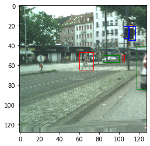
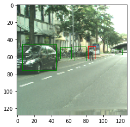

# YOLO-Pytorch

Implementation of YOLO in Pytorch for Object Detection.

Paper Link: (https://arxiv.org/abs/1506.02640)

-The folder contains a Python notebook file which can be run in Google Colab.

## Results

Example outputs :  

After performing NMS (Non Max Suppression) on outputs and assigning classes to pedestrians, traffic lights and cars.

